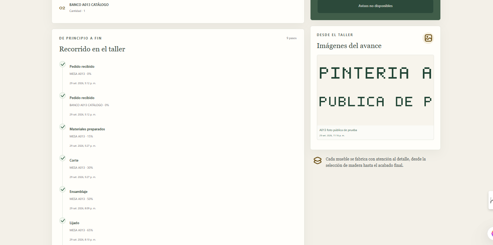

# Carpintería Ordenada 360° — Frontend V1

Interfaz React + TypeScript + Vite para administrar pedidos y coordinar el trabajo del taller. La API NestJS vive en el repositorio hermano `Bcarpinteria`; PostgreSQL permanece dentro del Compose local aprobado.

## Arranque

Desde esta carpeta:

```powershell
docker compose up --build
```

La aplicación está en <http://127.0.0.1:8080>; la API usa el prefijo `/api`. El puerto de PostgreSQL no se publica al host. El volumen `carpinteria_pgdata` conserva los datos y `carpinteria_uploads` conserva las fotografías.

Si aún no hay usuarios, crea una cuenta local con variables de entorno temporales (sin guardar credenciales en archivos versionados):

```powershell
$env:SEED_ADMIN_EMAIL = 'admin@local.test'
$env:SEED_ADMIN_PASSWORD = '<contraseña propia de 12 o más caracteres>'
docker compose exec -e SEED_ADMIN_EMAIL -e SEED_ADMIN_PASSWORD backend npm run seed
Remove-Item Env:SEED_ADMIN_EMAIL, Env:SEED_ADMIN_PASSWORD
```

La guía completa del backend y los roles está en `Bcarpinteria/README.md`.

## Pantallas

- **Resumen:** pedidos activos/listos, producción por etapa, incidencias abiertas, alertas de stock y movimientos recientes.
- **Inventario:** importa después de revisar el Excel, crea y edita artículos, administra stock y unidades físicas, y decide si cada retazo se conserva o descarta.
- **Clientes y productos:** búsqueda, alta y edición. El catálogo no fija materiales; cada pedido define lo que se fabricará.
- **Pedidos:** carrito con varias líneas (catálogo, mueble personalizado o material vendible), dimensiones en mm/cm/m, cotización del servidor, pagos manuales, ficha PDF + QR, WhatsApp manual y enlace de seguimiento.
- **Producción:** componentes y piezas por línea del pedido, planos SVG de sugerencia de corte, reserva/consumo, etapas e historial, pausas, notas internas/públicas, incidencias y fotos públicas u ocultas. Si el plano no ubica todas las piezas, muestra el diagnóstico que calcula el backend (motivo, stock físico por material, piezas agrupadas y acciones de recuperación).
- **Unidades de inventario:** el campo «Unidad de inventario» es un Select con el catálogo controlado que expone el backend (`GET /api/inventory/units`); no admite texto libre. Ver `src/units.ts`.
- **Sistema visual:** layout, uso de cards, motion, estados de carga, error, vacío y éxito, e iconografía están descritos en `docs/VISUAL_SYSTEM.md`. Los assets de terceros y sus licencias están en `docs/THIRD_PARTY_ASSETS.md`.
- **Dimensiones:** la UI usa tres medidas, **Largo × Ancho × Alto**, que se envían al backend como `lengthMm`, `widthMm` y `thicknessMm` (en madera, el alto es el espesor). El selector de madera muestra cuántas piezas físicas disponibles hay y con qué alto; si todas tienen el mismo, el alto se sugiere y sigue siendo editable. Ver `src/dimensions.ts`.
- **Seguimiento público:** `/seguimiento/<token>` sin cuenta de cliente, con estado, producto, porcentaje, timeline, fotos y notas públicas. Web Push solo solicita permiso al pulsar “Activar avisos”; las notificaciones se activan por pedido y navegador.
- **Configuración y usuarios:** IGV, kerf, datos del taller, cuentas, rol y estado activo.

El menú se filtra por rol: `TESTER` tiene todos los permisos, `ADMIN` administra el taller y `OPERARIO` trabaja con producción e inventario. El backend repite cada control de autorización.

## Desarrollo

```powershell
npm install
npm run typecheck
npm run build
npm run dev
```

Sin Docker, Vite escucha en 5173 y usa `VITE_PROXY_TARGET` para `/api`. Para la URL única 8080 y la persistencia local, usa el Compose del proyecto. No se necesita ni modifica el archivo Excel fuente.

## Configuración

Compose interpola `Carpinteria/.env` (ejemplo en `.env.example`). El backend usa `JWT_SECRET` estable para conservar sesiones entre reinicios; si se omite en desarrollo, usa una clave efímera. Las notificaciones requieren `VAPID_SUBJECT`, `VAPID_PUBLIC_KEY` y `VAPID_PRIVATE_KEY`, y quedan apagadas si no están configuradas.

En `compose.yml`, las claves Web Push se leen opcionalmente desde `Bcarpinteria/.env` y solo se pasan al contenedor backend. No guardes la clave privada en este repositorio ni en el `.env` del frontend. Para generar claves, desde `Bcarpinteria` ejecuta `npx web-push generate-vapid-keys` y conserva ambos valores en el `.env` local ignorado por Git. El `VAPID_SUBJECT` puede ser un contacto local de desarrollo. Para enviar una prueba desde Configuración, `PUSH_TEST_ORDER_CODES` debe señalar códigos QA permitidos; el panel solo envía a la suscripción seleccionada.

`compose.prod.yml` conserva el mismo puerto `127.0.0.1:8080`, sirve los archivos compilados desde nginx, exige `JWT_SECRET` y usa sus propios volúmenes persistentes. V1 sigue siendo local y no incluye despliegue cloud.

## Instalación para la presentación V1

**Requisitos:** Windows 10/11, Docker Desktop iniciado en modo de contenedores Linux y Docker Compose v2. No se requiere instalar PostgreSQL localmente. Para ejecutar Vite fuera de Docker se necesita Node.js compatible con Vite 8 (Node.js 22) y npm. Mantén el Excel fuente en `..\Bcarpinteria\bd\inventario g.xlsx`; Compose lo monta en la API como solo lectura.

Desde esta carpeta, crea `.env` desde `.env.example` si hace falta y arranca el modo local:

```powershell
docker compose up --build
```

Abre <http://127.0.0.1:8080>. La API vive bajo `/api` y su salud se consulta en <http://127.0.0.1:8080/api/health>. El seguimiento público usa `/seguimiento/<token>`. Para detener el modo local, ejecuta `docker compose down` desde esta carpeta. Se conservan PostgreSQL en el volumen nombrado `carpinteria_pgdata` y las fotos en `carpinteria_uploads`; no ejecutar `docker compose down -v` sobre la base que se usará en la exposición.

`compose.yml` es el entorno local de desarrollo, con fuentes montadas, Vite/NestJS y PostgreSQL dentro de Docker. `compose.prod.yml` genera los builds de producción, sirve la interfaz con Nginx y exige secretos definidos; usa los volúmenes independientes `carpinteria_prod_pgdata` y `carpinteria_prod_uploads`. Para esta presentación se usa `compose.yml`. PostgreSQL no expone un puerto al equipo anfitrión.

El acceso distingue `TESTER`, `ADMIN` y `OPERARIO`; el menú y las rutas permitidas dependen del rol y la API aplica sus propias comprobaciones. Web Push requiere `VAPID_SUBJECT`, `VAPID_PUBLIC_KEY` y `VAPID_PRIVATE_KEY`; sin esas claves el resto de la aplicación y el seguimiento siguen disponibles. Además del modo LOCAL, existe un modo **SUPABASE QA** (base de datos y fotos en Supabase) que se levanta con `npm run stack:supabase` y se abandona con `npm run stack:local`, sin editar `.env`. La cabecera interna muestra `LOCAL` o `SUPABASE QA`; ver `docs/SUPABASE_RUNTIME.md`. El frontend no usa Supabase directamente y nunca debe recibir claves de Supabase en variables `VITE_*`. No hay pasarela de pago ni facturación SUNAT; los pagos se registran manualmente.

Las cuentas de presentación son `demo-tester@local.test` (`TESTER`), `demo-admin@local.test` (`ADMIN`) y `demo-operario@local.test` (`OPERARIO`). Sus contraseñas están solo en `%USERPROFILE%\.codex\local-secrets\Carpinteria\demo-access.txt`, fuera de ambos repositorios; no guardes contraseñas reales en README, `.env` ni archivos versionados. Para una base vacía, la guía de backend explica el seed por variables `SEED_TESTER_*`, `SEED_ADMIN_*` y `SEED_OPERATOR_*`. No vuelvas a ejecutar el seed sobre la base poblada de presentación: también puede actualizar los productos iniciales. En esa base, las cuentas se administran desde Configuración > Usuarios.

## A014.7: tracking, Web Push y mascota

El tracking ocupa el ancho disponible, adapta el contenido a móvil y tablet, y muestra estados contextuales de carga, error, espera y ausencia de contenido. La mascota **Nudo** usa el componente SVG `Backpack` de React Kawaii con una paleta verde bosque y textos estáticos. La licencia MIT y atribución están en `docs/THIRD_PARTY_ASSETS.md` y `THIRD_PARTY_LICENSES/react-kawaii-MIT.md`.

El Service Worker muestra título, mensaje e iconos enviados por el backend y abre el seguimiento correspondiente al tocar el aviso. Solo reciben push los cambios públicos del pedido. La página consulta si el navegador ya está suscrito para ese pedido; desactivar el aviso solo deshabilita ese pedido y conserva la suscripción del navegador para otros pedidos.

Nudo también aparece como botón flotante de ayuda. Al pulsarlo abre un Popover HeroUI con consejos locales de la pantalla actual; en el tracking utiliza etapa, avance y conteos públicos ya cargados. «Otro consejo» evita repetir la misma frase dos veces seguidas, no hay rotación automática ni peticiones adicionales. Si el permiso está bloqueado, explica el estado sin volver a pedirlo. El panel se cierra con Escape o al pulsar fuera y se ajusta al viewport. No se encontró un botón global flotante de WhatsApp.

La activación de Web Push espera a que el Service Worker llegue a `activated` antes de llamar a `PushManager.subscribe`; si el navegador no termina de prepararlo, muestra una indicación recuperable. Los resultados de cierre, tamaños responsive, Lighthouse y deudas aceptadas están en [A014.7 — freeze local](docs/A014.7-LOCAL-FREEZE.md). El CSS de HeroUI se conserva como deuda técnica: el último build generó 559.12 kB de CSS (65.89 kB gzip); queda aceptado para esta presentación.
